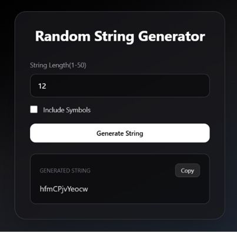
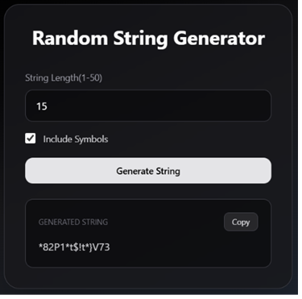

#  Random String Generator

A React application that generates secure random strings based on user-selected options. Users can customize the string length and choose the character types to include.

---

## Features ✨

- Generate random strings instantly
- Customize string length
- Include uppercase letters
- Include lowercase letters
- Include numbers
- Include special characters
- Copy generated string to clipboard
- Responsive UI built with Tailwind CSS

---

## Tech Stack 🛠️

- React
- Vite
- Tailwind CSS
- JavaScript

---


###  Default Page:-

<p align="center">
  
</p>

###  Generated String:-

<p align="center">
  
</p>

---

## 🚀 Getting Started

```bash
npm install
npm run dev
```
